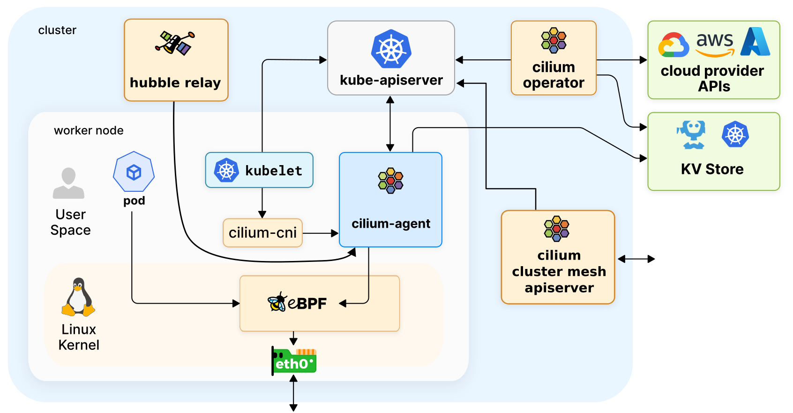

# cilium-cluster-kind


## Prerequisite

- Kind (version >= v0.7.0): https://kind.sigs.k8s.io/docs/user/quick-start/#installation
- Cilium CLI: https://docs.cilium.io/en/v1.13/gettingstarted/k8s-install-default/#install-the-cilium-cli

## Architecture


## Create the cluster

```
kind create cluster --config=kind-config.yaml
```

## Install Cillium to Cluster

```
cilium install
```

## Enable Hubble

```
cilium hubble enable --ui
```
